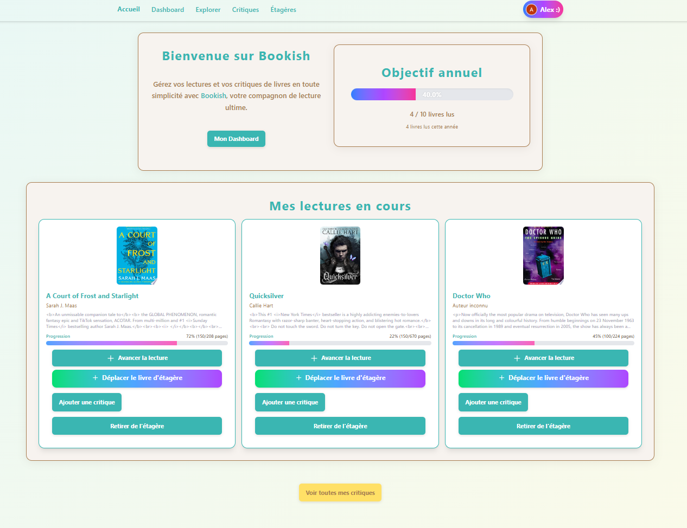
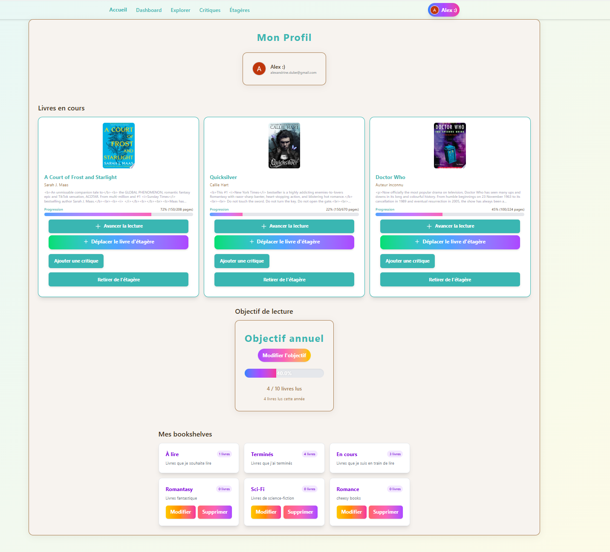
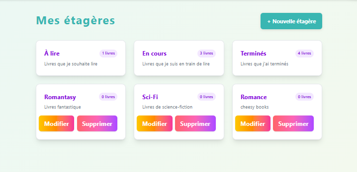
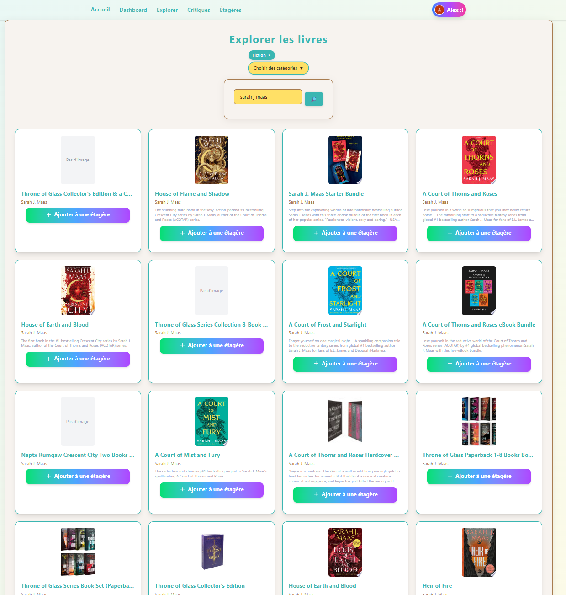
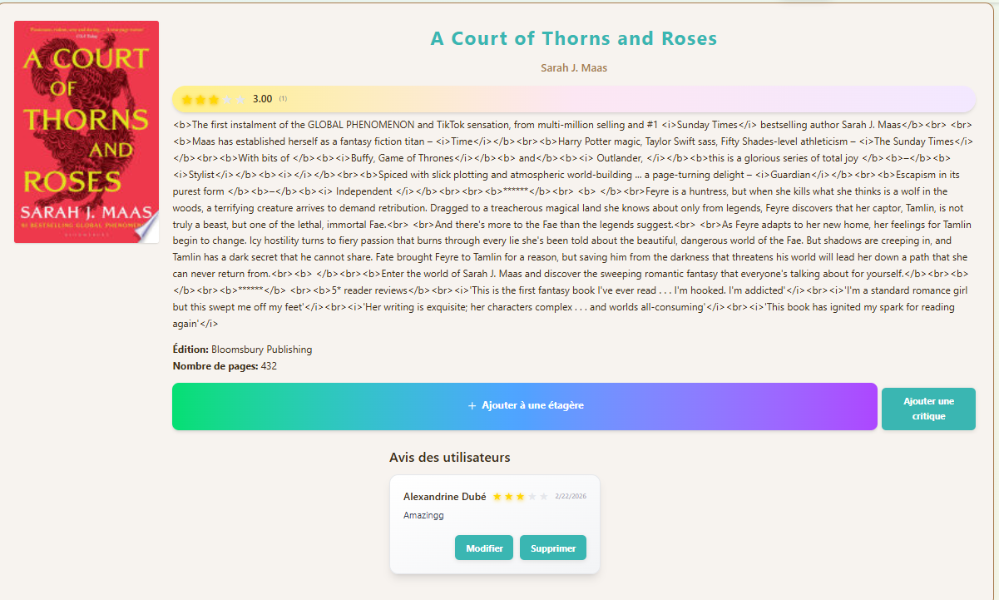

# BookishApp

## 1. Description du projet

- **Lien GitHub** : [https://github.com/AlexStarlight03/BookishApp](https://github.com/AlexStarlight03/BookishApp)
- **Objectif** : BookishApp est une application web permettant aux utilisateurs de gérer leurs lectures, les noter, et garder le tout organisé.
- **Fonctionnalités principales** :
  - Authentification (connexion, inscription, menu utilisateur)
  - Gestion des livres, critiques, et étagères
  - Ajout de livres via l’API Google Books
  - Suivi de la progression de lecture et objectif de lecture annuel

## 2. Technologies utilisées

- Next.js 16.1.6 (Turbopack)
- React 18+
- Prisma ORM
- Tailwind CSS
- Stack Auth
- Google Books API
- TypeScript

## 3. Instructions d’installation

1. **Cloner le projet**
   ```bash
   git clone https://github.com/AlexStarlight03/BookishApp.git
   cd BookishApp
   ```
2. **Installer les dépendances**
   ```bash
   npm install
   ```
3. **Configurer les variables d’environnement**
   - Copier `.env.example` en `.env` et ajouter les valeurs nécessaires pour une base donnée sur Neon, un projet Stack Auth et une clé d'API Google Books
4. **Lancer les migrations Prisma**
   ```bash
   npx prisma migrate deploy
   ```
5. **Démarrer le serveur de développement**
   ```bash
   npm run dev
   ```

## 4. Variables d’environnement

- DATABASE_URL=
- NEXT_PUBLIC_STACK_PROJECT_ID=
- NEXT_PUBLIC_STACK_PUBLISHABLE_CLIENT_KEY=
- STACK_SECRET_SERVER_KEY=
- NEXT_PUBLIC_GOOGLE_BOOKS_API_KEY=

## 5. Captures d’écran

1. **Page d’accueil et authentification**
   
2. **Dashboard avec progression annuelle**
   
3. **Gestion des étagères et livres**
   
4. **Explorer et rechercher des livres**
   
5. **Détails de livre**
   

## 6. Auteur(s)

- Alexandrine Dubé
